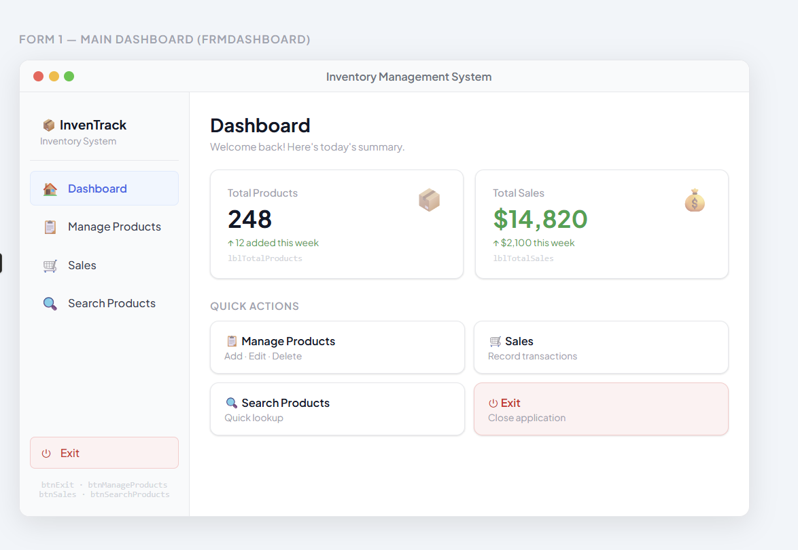
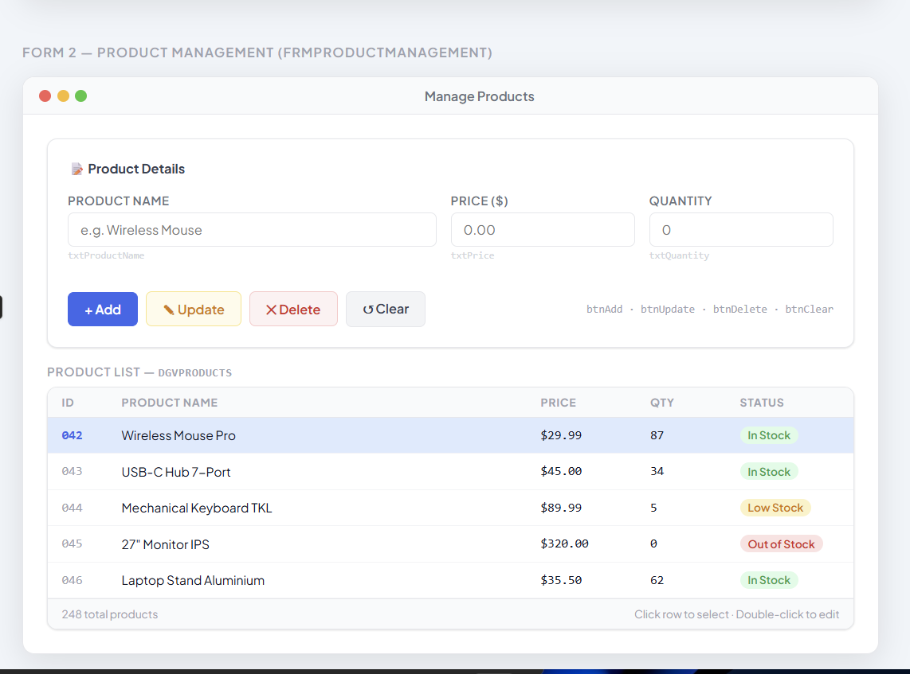
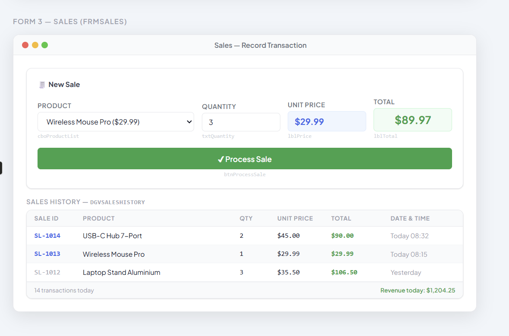

# Sale Store Management System
This system is made to manage store.
## Requirements

* Visual Studio 2022
* .NET 8 or later
* SQL Server

## Setup

## 1️⃣ Clone the Repository

## 📁Project Structure

The project is organized into several folders to maintain clean architecture.

```
StoreSalesManagementSystem
│
├── Models
│     Product.cs
│     Sale.cs
│
├── Data
│     DatabaseConnection.cs
│
├── Repositories
│     ProductRepository.cs
│
├── DesignPatterns
│     Singleton
│          DatabaseConnection.cs
│
│     Factory
│          ProductFactory.cs
│
│     Strategy
│          IPaymentStrategy.cs
│          CashPayment.cs
│
│     Observer
│          IObserver.cs
│          ProductNotifier.cs
│
├── Forms
│     frmDashboard.cs
│     frmProductManagement.cs
│     frmSales.cs
│     frmSearchProduct.cs
│
└── Program.cs

```
```
git clone https://github.com/yourusername/Sale_Store_Management.git

```
## 2️⃣ Open the Project in Visual Studio


 >Open Visual Studio

  >Click Open a project or solution

Select the file:  
  >  **Sale_Store_Management.sln**

This will load the entire project.
## 3️⃣ Restore NuGet Packages

> Tools → NuGet Package Manager → Restore NuGet Packages

#### User Terminal 
 > dotnet restore

## 4️⃣ Setup Database
  >1. Open appsettings.json or connection string

  >2.Change database connection

 > **Example :

```
"ConnectionStrings": {
  "DefaultConnection": "Server=.;Database=SaleStoreDB;Trusted_Connection=True;"
}

```

## 5 Ui MockUp :

#### Form 1 — Main Dashboard (frmDashboard)


### How to Create Product Form
> Control

```
TextBox
txtName
txtPrice
txtQty

Buttons
btnAdd
btnUpdate
btnDelete
btnSearch

DataGridView
dataGridProducts
```

#### Form 2 Form 2 — Product Management (frmProductManagement)


> add Control
```

```

#### Form 3 — Sales (frmSales)


#### Form 4 — Search Product (frmSearchProduct)


